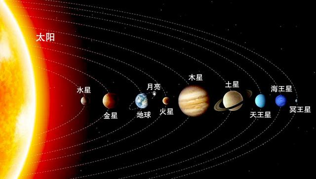

# 图片元素

## img 元素

...html

...

### 属性
1. src - source 表示图片的位置
2. alt - 当图片显示不出时，使用该元素的文字代替图片

### 与 a 元素联用

```html
<a href="http://www.baidu.com/" target="_blank">
    
</a>
```

### 与 map 元素联用

```html


<map name="solarMap">
   <area shape="circle" coords="400,326,200" href="https://baike.baidu.com/item/%E6%9C%A8%E6%98%9F/222105" target="_blank">
</map>
```

area 可以绘制圆形、长方形、多边形（circle、rect、poly）

### 与 figure 元素联用

指定、定义，通常把用于把图片、图片标题、描述包裹起来，有利于html的语义化

子元素figcaption，指代标题

```html
<figure>
        

        <map name="solarMap">
            <area shape="circle" coords="400,326,200" href="https://baike.baidu.com/item/%E6%9C%A8%E6%98%9F/222105" target="_blank">
        </map>
    
        <figcaption>
            <h2>太阳系</h2>
        </figcaption>
        
    </figure>
```
